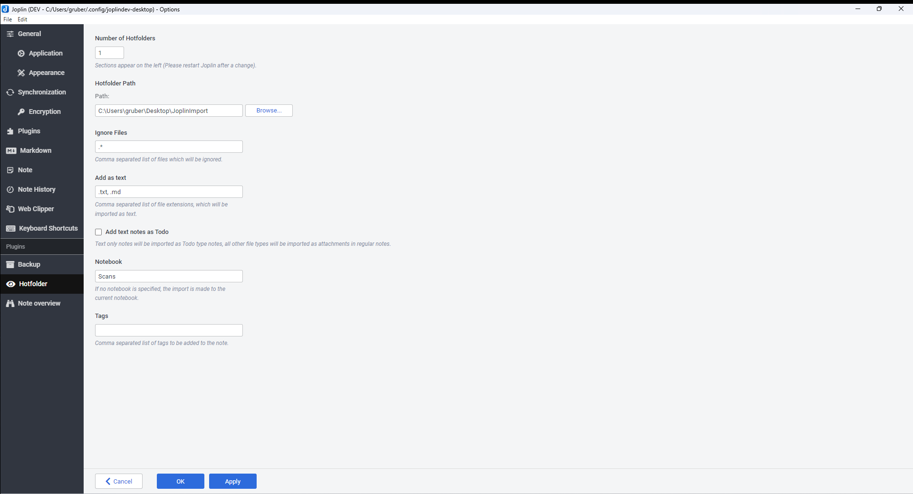

# Joplin Plugin: Hotfolder 

A plugin to Monitor a locale folder and import the files as a new note.

<!-- prettier-ignore-start -->
<!-- TOC depthfrom:2 orderedlist:false -->

- [Installation](#installation)
    - [Automatic](#automatic)
    - [Manual](#manual)
- [Usage](#usage)
- [Options](#options)
- [Changelog](#changelog)

<!-- /TOC -->
<!-- prettier-ignore-end -->

## Installation

### Automatic

- Go to `Tools > Options > Plugins`
- Search for `Hotfolder`
- Click Install plugin
- Restart Joplin to enable the plugin

### Manual

- Download the latest released JPL package (`io.github.jackgruber.hotfolder.jpl`) from [here](https://github.com/JackGruber/joplin-plugin-hotfolder/releases/latest)
- Close Joplin
- Copy the downloaded JPL package in your profile `plugins` folder
- Start Joplin

## Usage

First configure the Plugin under `Tools > Options > Hotfolder`!

Each newly created file in the hotfolder is automatically created as a new note.
The files are added as attachments unless the file extension is defined as `Add as text`.
After processing the file are deleted from the hotfolder.

## Options

Go to `Tools > Options > Backup`

## Changelog

See [CHANGELOG.md](CHANGELOG.md)
