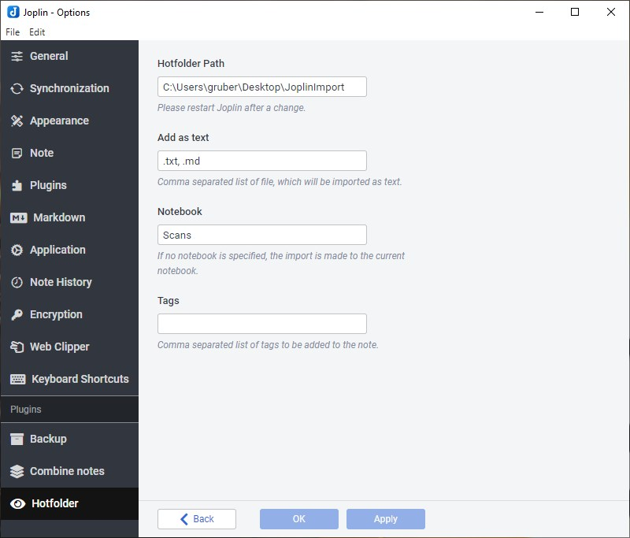

# Joplin Backup Plugin

A plugin to Monitor a locale folder and import the fiels as a new note.

## Installation

### Automatic

- Go to `Tools > Options > Plugins`
- Search for `Hotfolder`
- Click Install plugin
- Restart Joplin to enable the plugin

### Manual

- Download the latest released JPL package (`io.github.jackgruber.hotfolder.jpl`) from [here](https://github.com/JackGruber/joplin-plugin-hotfolder/releases/latest)
- Close Joplin
- Copy the downloaded JPL package in your profile `plugins` folder
- Start Joplin

## Usage

First configure the Plugin under `Tools > Options > Hotfolder`!

Each newly created file in the hotfolder is automatically created as a new note.
The files are added as attachments unless the file extension is defined as `Add as text`.

## Options

Go to `Tools > Options > Backup`

- `Hotfolder Path`: Files from this path will be imported as new notes.
- `Add as text`: Files with this file extension are imported as text and not as attachment. Default `.txt, .md`.
- `Notebook`: In which notebook should the note be created. Default: `Current selected Notebook`.
- `Tag`: Comma separated list of tags to be added to the note.

## Changelog

See [CHANGELOG.md](CHANGELOG.md)

## Links

- [Joplin - Getting started with plugin development](https://joplinapp.org/api/get_started/plugins/)
- [Joplin - Plugin API reference](https://joplinapp.org/api/references/plugin_api/classes/joplin.html)
- [Joplin - Data API reference](https://joplinapp.org/api/references/rest_api/)
- [Joplin - Plugin examples](https://github.com/laurent22/joplin/tree/dev/packages/app-cli/tests/support/plugins)
